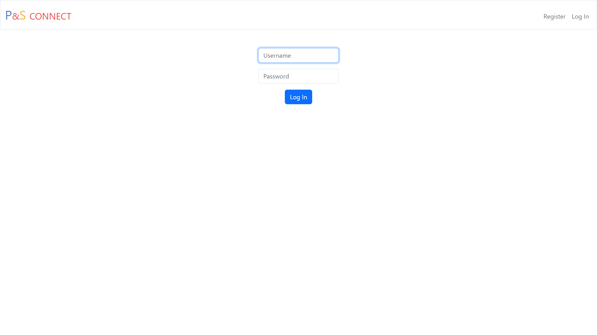

# PnS-Connect

A webapp that can store and use student data and other data that might concern a student database. This project has a long way to go and any help would be appreciated.

## Getting Started

Assuming that you have python and all of the required packages in `requirements.txt`, you can just run `app.py` and all should work perfectly.

## Technologies used

Python 3.12.4

### Python Packages

flask 3.0.3 | flask session 0.8.0 | Jinja2 3.1.4

## How to use

### Login and registration

This part of the application is like any other login and registration system. Login if you have an account, register if you don't. You need to confirm your password twice while registering.

### Home (/)

It shows a list of all the user's children.
You can do a number of things here:

- Show children: you can see all the children along wih their pictures and more details
- Switch to dark mode: using the slider in the top right of the page, you can switch to dark mode:
  
- Logout
- Change your password
- Add New Student

### Add new Student(/new)

- It shows the form to add the details of the new student
 
- Add Student: By clicking on the Add Student button it add the students details to the list and also shows on the children page.

### Contributing

Please read the [Contributing Guidlines](https://github.com/Genius-Raptor/PnS-Connect/blob/master/CONTRIBUTING.md)
